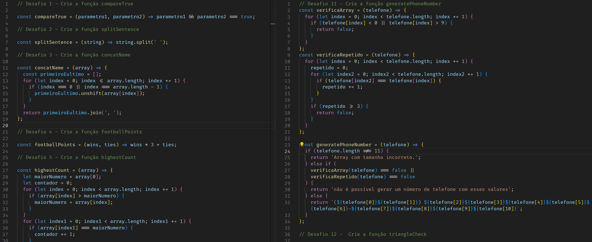

# README: Playground Functions



<br/>

## Project Description

This project was designed to exercise my logic with a few challenges, such as calculating triangle areas, modifying strings, and implementing the classic Fizz Buzz problem.

### Technologies

- LINUX
- VSCODE
- JAVASCRIPT

### What I Learned

- Javascript methods such as unshift, join and Math.abs

## How to Run the Project

1. Clone the repository:

   ```bash
   git clone https://github.com/feduarte-dev/playground-functions
   ```

2. Navigate to the project directory:

   ```bash
   cd your-repository
   ```

3. Install dependencies:

   ```bash
   npm install
   ```

4. Call functions inside /src/challenges*

## Contributions

[Felipe](https://www.linkedin.com/in/feduarte-dev/) - /src


[Trybe](https://www.betrybe.com/) - Everything else
